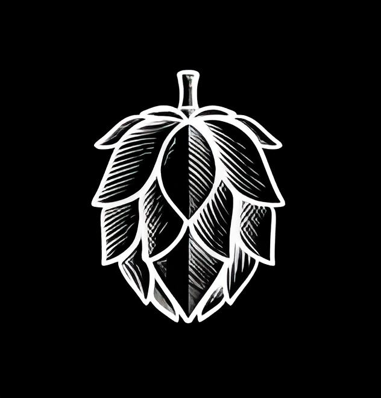

 

<strong>Desafio Chefão - Gama Academy</strong>

 

## 📋 <strong>Enunciado</strong>

Uma empresa de cervejas artesanais precisa de uma aplicação web para poder mostrar e realizar a venda de suas cervejas.

 

## 	🛠️<strong> Pré-requisitos </strong>

 1. Necessário que tenha instalado o Node.js - (https://nodejs.org/en/)
 

## ⚙️<strong>Inicialização do projeto</strong>

Para executá-lo:

    1. Digitar "npm install" no seu console e dar enter.
    2. Depois digitar "npm run start" e enter novamente.

## 💾 Backend do projeto
[Link do repositório backend](https://github.com/MonicaIacy/breja-backend)
 

## 🎨 Design do projeto
[Link do Figma](<https://www.figma.com/file/2nTAohofjlF39UOJehzENN/Desafio-Final-.-Cervejaria-Breja?node-id=0%3A1&t=Bo4UEYzusFUUVKyW-0>)
 

## 🖥 <strong>Tecnologias</strong>
 

 

## 👤 <strong>Contribuidores</strong>
<table align="left">
  <tr>
   <td align="center">  <a href="https://github.com/OrcFofa">Laura Santos</a>
   </td>
   <td align="center">  <a href="https://github.com/JessicaArf">Jessica Leal</a>
   </td>
   <td align="center">  <a href="https://github.com/Johnnatangomes">Johnnatan Gomes</a>
   </td>
   <td align="center">  <a href="https://github.com/halineds">Haline Dias</a>
   </td>
  <td align="center">  <a href="https://github.com/Joaogarske">João Garske</a>
   </td>
    <td align="center">  <a href="https://github.com/socorrosans">Socorro Santos</a>
   </td>
    <td align="center">  <a href="https://github.com/amauri650">Amauri Xavier</a>
   </td>
</table>

